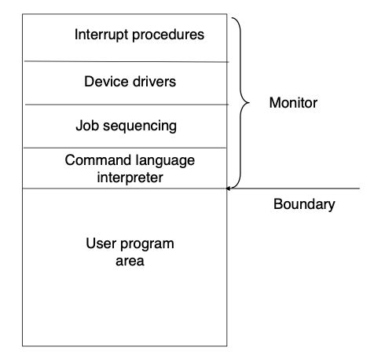

# History of Operating Systems
## Serial Systems
Computers in their earliest form were non-programmable – they were built for a certain purpose and could not be used for anything else. The development of stored program computers (which were general-purpose) was pioneered by Alan Turing and John von Neumann. The first marketable general purpose computer was released in 1951.  
In these early systems, the programmer interacted directly with the hardware through display lights, switches, the printer and the card reader (which together formed a console). There was no operating system. There were several issues with this arrangement:

* Scheduling was done manually by a signup sheet, instead of being automated.
* Job setup, which included mounting and un-mounting tapes, setting up card desks, and loading and compiling a program, was a heavy overhead.

Later, additional software and hardware were created, enabling the reuse of software. Libraries, loaders and common functions were developed; for example, device drivers, which were special subroutines for each I/O device. Compilers (for FORTRAN, COBOL, etc.) were also created.

The issues were solved by hiring professional computer operators (whose experience reduced the setup time), and batching together similar jobs. Even so, however, the CPU was idle during transition time – this led to the development of automatic job sequencing, which was the first rudimentary OS. This was called a *resident monitor*, which is always present in main memory and has control of the CPU. Monitors also implemented batching of similar jobs for the CPU.

## Simple Batch Systems
Consider the algorithm for a monitor. When it starts a job, it first loads the corresponding subroutines and functions, and then control is passed to the user's program. After completion, the monitor regains control of the CPU.

The batch OS relies on the ability of the machine to retrieve instructions from various parts of main memory. It had the following features:

* memory protection: the region of memory where the monitor is stored should not be written to.
* timer: a single job is prevented from monopolising the processor.
* privileged instructions (or syscalls): some instructions (usually I/O) cannot be called by user programs.
* interrupts: they allow control to shift between the user program and the OS, and gives the OS more flexibility.

Although the monitor consumed memory and CPU time, it improved the overall performance of the computer.

Under-utilisation of the CPU, however, remained an issue. The speed of mechanical devices like card readers could not keep up with the microsecond range that CPUs executed instructions in. Most of the CPU's time is spent in reading from and writing to tape.

### Spooling
Disk technology emerged in the 1970s and 1980s. It introduced a technique called SPOOLing (simultaneous peripheral operations on-line). This process considers the disk as a huge buffer for instructions, allowing the CPU to take input, produce output, and carry out processing, all at the same time, by reading instructions from the disk. This allowed the I/O of one job to be overlapped with the computation of other jobs, keeping both the processor and I/O devices working at higher rates. Further, the fact that the disk was a random access device was advantageous.

## Multiprogrammed Batched Systems
Multiprogramming increases CPU utilisation by organising jobs such that the CPU is always busy. Several jobs are kept in memory at one time, and the CPU is multiplexed among them. This allowed for optimal utilisation of the CPU even through I/O operations.  
For example, if a certain job requires a tape to be mounted, the CPU, instead of sitting idle, takes up another job until the first job can be resumed.

Thus, the OS here is responsible for job scheduling and *memory management* – which was now necessary as several programs had to be stored in the memory.

## Interactive Computing
Multiprogramming, while it increased utilisation, had the effect of increasing response time. This led to the notion of timesharing. Rather than waiting for a program to have an I/O operation to switch between jobs, the CPU spends a fixed amount of time on each job before switching.

Timesharing allows many users to share a computer simultaneously, while giving the impression that each user has their own system.