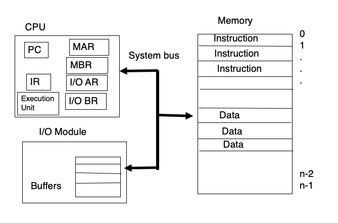
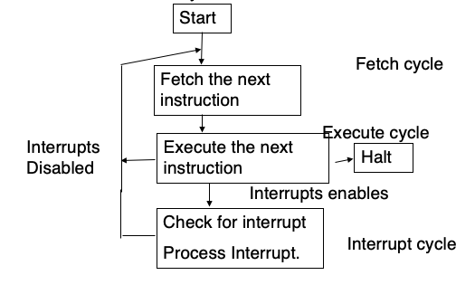

# Computer Systems
## Organisation
A computer system generally consists of one or more CPUs and device controllers connected through a common bus (which provides access to the shared memory). Thus, broadly, the components of a computer include the processor, memory, and I/O devices.  
The I/O devices can execute concurrently with the CPU. Each device type has a corresponding device controller, which has its own local buffer: thus the device moves data to and from the controller's local buffer, while the CPU moves data between the local buffer and the main memory.  
The device controller informs the CPU when to carry out this operation by causing an *interrupt*.

## Architecture
Most computers today follow the von Neumann architecture, with a central processor communicating with I/O on one side and the memory (programs and data) on the other side.

The functions of various components of the processor are

* MAR (memory address register): holds the address of the next location in memory to be read/written.
* MBR (memory buffer register): holds the data to be written to memory, if any.
* I/O AR (I/O address register): holds the address of the I/O device.
* I/O BR (I/O buffer register): hold the data to be sent to output.

These registers, in addition to the program counter, instruction register, and PSW (program status word: stores a set of flags, like sign, overflow, or interrupt enable/disable), are called *control* or *status* registers. The processor also include *user-visible* registers, which may be data registers or address registers.

# Operation of OS
## Interrupts
The CPU follows an ordinary fetch-execute cycle from the moment it is switched on. However, to improve performance, interrupts are provided as a feature – they allow the processor to be engaged in executing something while an I/O operation is in progress.

Although this takes up some of the processor's time in checking for interrupts, it improves flexibility significantly.

An interrupt, in general, transfers control to the interrupt service routine through the *interrupt vector* (which holds the addresses of these routines). The address of the interrupted instruction is saved, to be resumed later.  
When an interrupt is being processed, incoming interrupts are disabled.

The CPI hardware has a wire called the *interrupt request line*, which is checked to detect interrupts during every cycle.

## I/O Structure
There are two main ways of carrying out I/O: *synchronous* and *asynchronous*. Synchronous I/O does not allow the CPU to continue execution without finishing an I/O process that has been started, whereas asynchronous I/O, control returns to the user program without waiting for completion of I/O. A *device status table* maintains the status of each operation, and the OS indexes into it and updates it as required.

There are three main ways data is transferred during I/O:

* Program data transfer: The I/O module does not interrupt the processor; the processor simply extracts data from main memory and shifts it to its destination. This is time-consuming and inefficient.
* Interrupt-driven data transfer: When I/O is ready, the CPU's execution is interrupted. Thus the CPU does not have to periodically check for I/O status.
* Direct Memory Access (DMA): This process directly transfers data from the local buffer to the memory, without passing through the CPU. The processor sends the information about the I/O process to the DMA module and continues execution; the DMA carries out the operation and then interrupts the processor.

## Protection from Errors
There are many parts of the system that protect from various kinds of errors. Some of these are dual mode operation, I/O protection, memory protection and CPU protection.

This provides hardware support to run in one of two modes – user mode and monitor (or system, or kernel) mode. There are some designated *privileged* instructions, which can be used only in monitor mode.  
The mode bit keeps track of which mode the system is in at any time. Interrupts put the system into monitor mode automatically.  
Dual mode operation protects the system and other programs from programs with errors.

I/O is protected by setting I/O instructions to be privileged instructions. Further, only interrupt instructions have the capacity to modify the interrupt vector.

Memory protection is implemented through the *base* and *limit* registers, which define the range of addresses accessible to a certain program. The instructions that load these registers are privileged.

## General Operation
When a user program asks the CPU to carry out I/O, the request is called a *system call*. System calls are treated by the hardware as interrupts; they shift the processor to monitor mode, and execution is transferred back to the user program after the call.