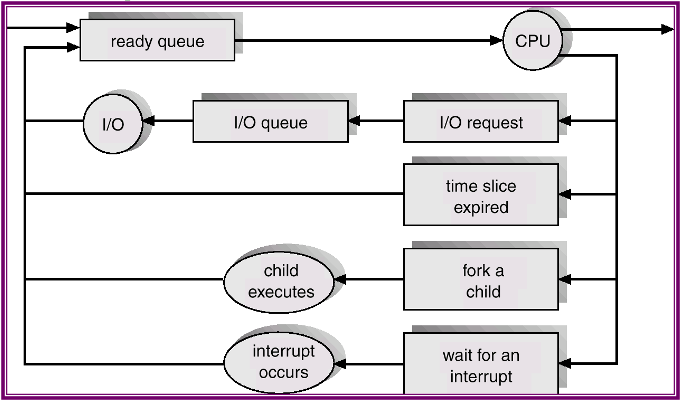

# Process Concepts (contd.)
The process control block (PCB) contains the state of the process, the process number, the program counter, the memory limits, a list of the open files, and the registers being used.

## Process Scheduling Queues
Scheduling allows the OS to decide which process to execute and when. The objective is to have some process running at all times. In order to do this, a number of queues are maintained:

* job queue: the set of all processes in the system.
* ready queue: the set of all processes residing in main memory, ready to be executed.
* device queues: the set of processes waiting for the I/O devices (each device has its own).
These queues contain the PCBs of the relevant processes.

A new process is initially put in the ready queue. Once the project is allocated some CPU time, it could

* issue an I/O request,
* create a new process, or
* be removed forcibly from the CPU due to an interrupt.
At termination, it is removed from all queues and all resources are deallocated.

## Schedulers
A scheduler is a program that selects processes to move from one queue to another. The *long-term* scheduler selects processes to be brought into the ready queue, while the *short-term* scheduler selects processes to allocate CPU time to.

A process may be *I/O-bound* (that spends more time doing I/O) or *CPU-bound* (that spends more time on computation). The LT scheduler should select a good mix of I/O- and CPU-bound processes.

Some OSs have also introduces a *medium-term* scheduler, which uses *swapping*. In other words, they shift processes from main memory to the disk to improve performance. The process can be later reintroduced into main memory and its execution can be continued.

The task of switching the CPU to another process is called *context switching*; it is an overhead that needs to be minimised. The exact time is dependent on hardware; it ranges from 1 to 1000 microseconds.

## Process Creation
A system call (`fork()` in UNIX) is used to create a process. It assigns a unique ID and some space, and initialises the PCB. The creating process is called a *parent* process, while the created process is called a *child* process.  
The `exec()` system call is used after `fork()` to replace the process's memory space with a new program.

Following `fork()`, both the parent and the child process execute the next instruction. A parent may terminate the execution of children processes if they exceed allocated resources. A child process cannot continue if a parent process terminates; this is called cascading termination.

*Cooperating* processes (as opposed to *independent* processes) are those which can affect or be affected by the execution of other processes. Inter-process communication (IPC) is carried out through message passing or shared memory.